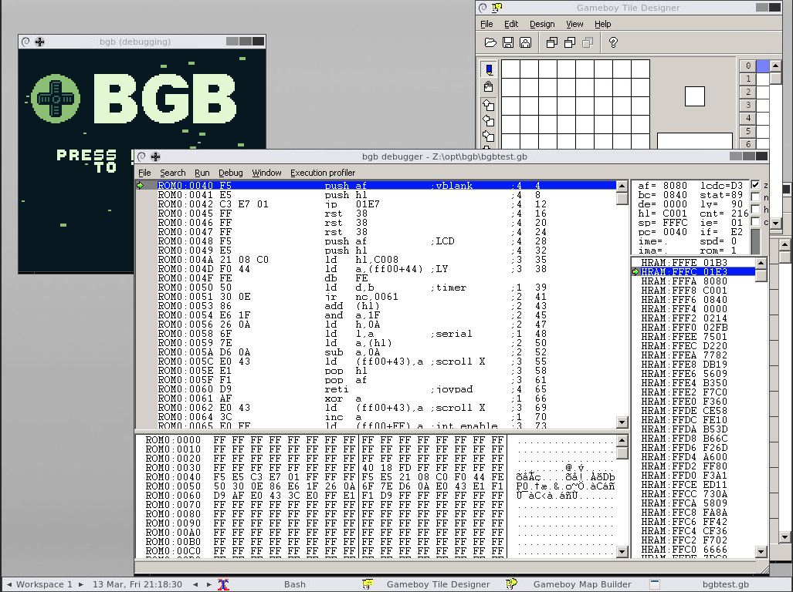

This is a docker-based full toolkit for developing gameboy games.



All you need is docker, and it should run on any OS:

```sh
mkdir work
docker run --name='gb' --rm -it -p 8080:8080 -v "${PWD}/work:/home/gbdev" konsumer/gb
```

Then open http://localhost:8080

A bunch of tools are installed, with an X-windows server, that runs VNC. It's got fluxbox and some windows tools setup with wine.

I also included [gbtdg](https://github.com/chrisantonellis/gbtdg) which is great for making splash images, at http://localhost:8080/gbtdg/

`/home/gbdev` is meant to be your working directory, as you are logged in as `gbdev`. This helps with permissions on mac/linux, as it makes it all run as user-1. In the above `docker run` example, I am volume-mounting it to a dir `work/`, so I can compile stuff in that dir. You can mount it however you like, though.

Some useful things to do:

```sh
# run text-mode bash inside container
docker exec -it gb bash

## inside container

# run Gameboy Tile Designer
wine /opt/gbtd/GBTD.EXE

# run Gameboy Map Builder
wine /opt/gbmb/GBMB.EXE

# run BGB Gameboy Emulator
wine /opt/bgb/bgb.exe
```

There is also GBDK/RGBDS installed in `/opt`, so you can use those in your makefiles. I also added some of these tools to the fluxbox menu (right-click on desktop.)

If you want to try it out, put the `example/` dir in your work folder, and run this:

```sh
docker run --name='gb' -d --rm -p 8080:8080 -v "${PWD}/work:/home/gbdev" konsumer/gb
docker exec -it konsumer/gb bash
cd example
make
wine /opt/bgb/bgb.exe demo.gb
docker kill gb
```

## more info

Here are the tools installed in your environment:

- [gbdk-2020](https://github.com/Zal0/gbdk-2020)
- [rgbds](https://github.com/rednex/rgbds)
- [gameboy tile designer](http://www.devrs.com/gb/hmgd/gbtd.html) (via wine)
- [gameboy map builder](http://www.devrs.com/gb/hmgd/gbmb.html) (via wine)
- [bgb gameboy emulator](https://bgb.bircd.org/) (via wine)
- [gameboy tile data generator](https://github.com/chrisantonellis/gbtdg) (running [on web](http://localhost:8080/gbtdg/))


## TODO

* make a tutorial with demo project